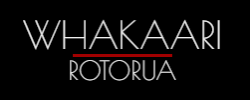

<!-- PROJECT LOGO -->
<br />
<p align="center">
  <a href="https://whakaari.netlify.app/">
    
  </a>

  <h1 align="center">WHAKAARI ROTORUA</h3>

  <p align="center">
    Whakaari Rotorua are a group of performers from Rotorua, New Zealand, who travel around the world sharing their Māori culture through traditional song and dance.  
    <br />
    <br />
    :round_pushpin:<a href="https://whakaari.netlify.app/">View Demo</a>
  </p>
</p>


<!-- TABLE OF CONTENTS -->
<details open="open">
  <summary>Table of Contents</summary>
  <ol>
    <li>
      <a href="#description-ledger">Description</a>
      <ul>
        <li><a href="#built-with">Built With</a></li>
      </ul>
    </li>
    <li>
      <a href="#getting-started-wrench">Getting Started</a>
      <ul>
        <li><a href="#prerequisites">Prerequisites</a></li>
        <li><a href="#installation">Installation</a></li>
      </ul>
    </li>
    <li><a href="#usage-mag">Usage</a></li>    
    <li><a href="#contact-mailbox_with_mail">Contact</a></li>
    <li><a href="#acknowledgements-clap">Acknowledgements</a></li>
  </ol>
</details>


<!-- ABOUT THE PROJECT -->
## Description :ledger:

<br/>

[![Porject image][project-image]](src/Assets/img/Thumbnails/whakaari.png)

<br/>

This website is built as an informational/brochure website for an indigenous performance arts group from my home country of New Zealand. As this group spends a large amount of their time touring Europe, multi-lingual support has been implemented with React to ensure exposure to their target audiences. An upcoming tour data carousel displaying tour dates, times and locations is present, alongside video media and an image gallery. Finally, a contact form is implemented with Formik and handled through Netlify forms.

Keep reading to see more about this project!

### Built With 

* [React](https://reactjs.org/)
* [CSS Modules](https://github.com/css-modules/css-modules)
* [Formik](https://formik.org/)
* [Framer Motion](https://www.framer.com/motion/)


<!-- GETTING STARTED -->
## Getting Started :wrench:

Follow these steps to get a local copy up and running.

### Prerequisites

* npm
  ```sh
  npm install npm@latest -g
  ```

### Installation

1. Clone the repo
   ```sh
   git clone https://github.com/tipenehughes/whakaari
   ```
2. Install NPM packages
   ```sh
   npm install
   ```
3. Run the app
   ```sh
   npm start
   ```

<!-- USAGE EXAMPLES -->
## Usage :mag:

:round_pushpin:<a href="https://github.com/tipenehughes/whakaari">View Live Demo Here!</a>
<br/>
<br/>
[![Site gif][site-gif]](src/Assets/img/Thumbnails/site.gif)
<br/>
<br/>
[![Language gif][language-gif]](src/Assets/img/Thumbnails/language.gif)
<br/>
:point_up: Language picker
<br/>
<br />
[![Tours gif][tours-gif]](src/Assets/img/Thumbnails/tours.gif)
<br/>
:point_up: Upcoming tours carousel


<!-- CONTACT -->
## Contact :mailbox_with_mail:

[![LinkedIn][linkedin-shield]][linkedin-url]

:e-mail: tipenehughes@gmail.com

Project Link: [https://whakaari.netlify.app/](https://whakaari.netlify.app/)

<!-- ACKNOWLEDGEMENTS -->
## Acknowledgements :clap:
* [Font Awesome](https://fontawesome.com/)
* [Yup](https://github.com/jquense/yup)
* [React Toastify](https://github.com/fkhadra/react-toastify)
* [Smooth Scroll](https://github.com/iamdustan/smoothscroll)


<!-- MARKDOWN LINKS & IMAGES -->
[linkedin-shield]: https://img.shields.io/badge/-LinkedIn-black.svg?style=for-the-badge&logo=linkedin&colorB=2867B2
[linkedin-url]: https://www.linkedin.com/in/tipene-hughes/
[project-image]: src/Assets/img/Thumbnails/whakaari.png
[site-gif]: src/Assets/img/Thumbnails/site.gif
[language-gif]: src/Assets/img/Thumbnails/language.gif
[tours-gif]: src/Assets/img/Thumbnails/tours.gif